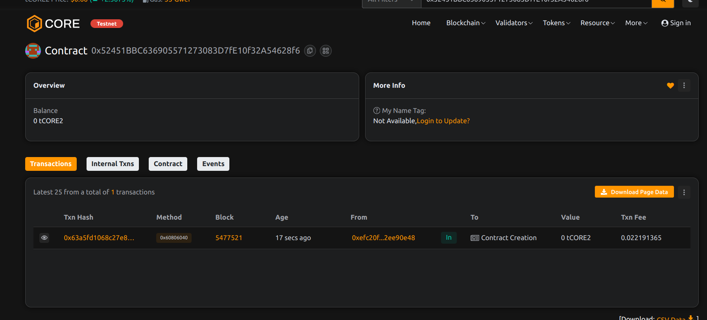

# VaultSplit – Multi-Owner Token Vault with Profit Sharing Logic

## 📄 Project Description

VaultSplit is a decentralized token vault for managing shared assets and distributing profits among multiple owners based on predefined share allocations.

## 🎯 Project Vision

To offer an on-chain profit sharing solution for joint ventures, investment groups, and DAO treasuries, ensuring transparency and automated fund allocation.

## ✨ Key Features

- 👥 Multi-owner vault with customizable share ratios
- 📤 Automated profit distribution
- 💰 On-chain ETH deposit tracking
- ✅ Permissionless fund contribution
- 🔄 Manual triggering of payout by any owner

## 🔮 Future Scope

- ERC-20 support for tokenized profit distribution
- Owner management via DAO governance
- Time-locked vaults or streaming payments
- Cross-chain asset vaulting

## 📜 Contract Details
0x52451BBC636905571273083D7fE10f32A54628f6
